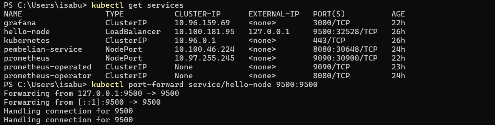
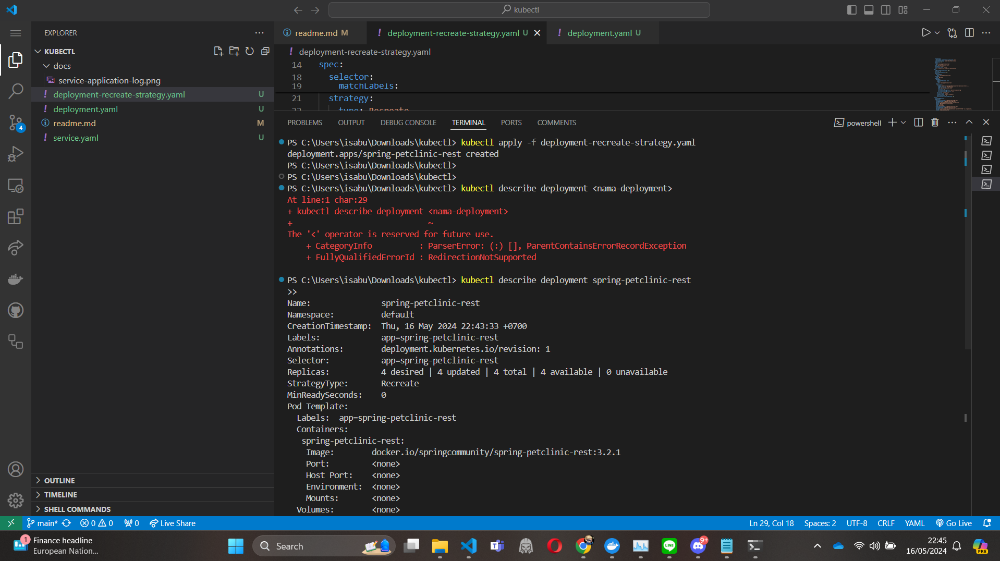

## Refleksi Deployment Kubectl (Tutorial 11)
### Refleksi Pertama

1. Compare the application logs before and after you exposed it as a Service. Try to open the app several times while the proxy into the Service is running. What do you see in the logs? Does the number of logs increase each time you open the app?


Sebelum diexposed sebagai service, tentu saja kita tidak dapat mengakses pod tersebut dari luar cluster. Sementara itu, setelah diexposed sebagai service, kita dapat mengakses pod tersebut dari luar cluster melalui external ip yang kita tempelkan pada service tersebut. Dengan mengakses external ip tersebut maka log aplikasi akan bertambah untuk menghandle koneksi yang masuk ke external ip tersebut.

2. Notice that there are two versions of `kubectl get` invocation during this tutorial section. he first does not have any option, while the latter has `-n` option with value set to `kube-system`. What is the purpose of the `-n` option and why did the output not list the pods/services that youexplicitly created? > Hint: Do some reading about [Namespace in Kubernetes document].

Opsi `-n` pada perintah `kubectl get` digunakan untuk menentukan namespace di mana Anda ingin melihat sumber daya. Dalam Kubernetes, namespace adalah cara untuk membagi sumber daya dalam sebuah kluster antara beberapa pengguna. Ketika Anda menjalankan `kubectl get` tanpa opsi apapun, perintah ini secara default akan menampilkan sumber daya di namespace `default`.

### Reflection on Rolling Update & Kubernetes Manifest File

1. What is the difference between Rolling Update and Recreate deployment strategy?

Perbedaan utama antara strategi deployment Rolling Update dan Recreate terletak pada cara mereka menangani pembaruan pod. Dalam strategi Rolling Update, pembaruan dilakukan secara bertahap dengan menggantikan pod lama satu per satu dengan pod baru, sehingga memastikan tidak ada downtime dan aplikasi tetap tersedia selama proses pembaruan. Sebaliknya, strategi Recreate menghentikan semua pod lama sebelum memulai pod baru, yang dapat menyebabkan downtime karena tidak ada pod yang menjalankan aplikasi selama periode transisi.

2. Try deploying the Spring Petclinic REST using Recreate deployment strategy and document
your attempt.

Saya membuat file deployment-recreate-strategy.yaml dan kemudian menuliskan kubectl apply -f deployment-recreate-strategy.yaml pada directory yang sama.


3. Prepare different manifest files for executing Recreate deployment strategy.

di deployment-recreate-strategy.yaml saya menuliskan
```
yaml

apiVersion: apps/v1
kind: Deployment
metadata:
  annotations:
    deployment.kubernetes.io/revision: "2"
  creationTimestamp: "2024-05-16T13:33:45Z"
  generation: 3
  labels:
    app: spring-petclinic-rest
  name: spring-petclinic-rest
  namespace: default
  resourceVersion: "47926"
  uid: 7ff23309-76cd-4c8a-9f39-0d89e1a36cbe
spec:
  progressDeadlineSeconds: 600
  replicas: 4
  revisionHistoryLimit: 10
  selector:
    matchLabels:
      app: spring-petclinic-rest
  strategy:
    type: Recreate
  template:
    metadata:
      creationTimestamp: null
      labels:
        app: spring-petclinic-rest
    spec:
      containers:
      - image: docker.io/springcommunity/spring-petclinic-rest:3.2.1
        imagePullPolicy: IfNotPresent
        name: spring-petclinic-rest
        resources: {}
        terminationMessagePath: /dev/termination-log
        terminationMessagePolicy: File
      dnsPolicy: ClusterFirst
      restartPolicy: Always
      schedulerName: default-scheduler
      securityContext: {}
      terminationGracePeriodSeconds: 30
status:
  availableReplicas: 3
  conditions:
  - lastTransitionTime: "2024-05-16T15:08:03Z"
    lastUpdateTime: "2024-05-16T15:08:03Z"
    message: Deployment has minimum availability.
    reason: MinimumReplicasAvailable
    status: "True"
    type: Available
  - lastTransitionTime: "2024-05-16T13:33:45Z"
    lastUpdateTime: "2024-05-16T15:13:41Z"
    message: ReplicaSet "spring-petclinic-rest-54f476f68" is progressing.
    reason: ReplicaSetUpdated
    status: "True"
    type: Progressing
  observedGeneration: 3
  readyReplicas: 3
  replicas: 5
  unavailableReplicas: 2
  updatedReplicas: 2
```
Saya mengganti field spec.strategy.type dari RollingUpdate menjadi Recreate

4. What do you think are the benefits of using Kubernetes manifest files? Recall your experience
in deploying the app manually and compare it to your experience when deploying the same app
by applying the manifest files (i.e., invoking `kubectl apply -f` command) to the cluster.

Menggunakan file manifest Kubernetes memiliki banyak keuntungan dibandingkan dengan melakukan deploy aplikasi secara manual. File manifest memungkinkan deklarasi yang jelas dan dapat diulang dari konfigurasi sumber daya Kubernetes, seperti pod, service, dan deployment, dalam format YAML atau JSON. Hal ini membuat proses deploy menjadi lebih konsisten, terdokumentasi, dan mudah dikelola, terutama untuk tim besar atau proyek kompleks. Dengan `kubectl apply -f`, deploy aplikasi menjadi otomatis dan lebih cepat, mengurangi kemungkinan kesalahan manusia yang sering terjadi dalam konfigurasi manual. Selain itu, manifest file memungkinkan versioning dan rollback yang lebih mudah melalui sistem kontrol versi seperti Git, meningkatkan kemampuan untuk melacak perubahan dan kembali ke versi sebelumnya jika diperlukan.
